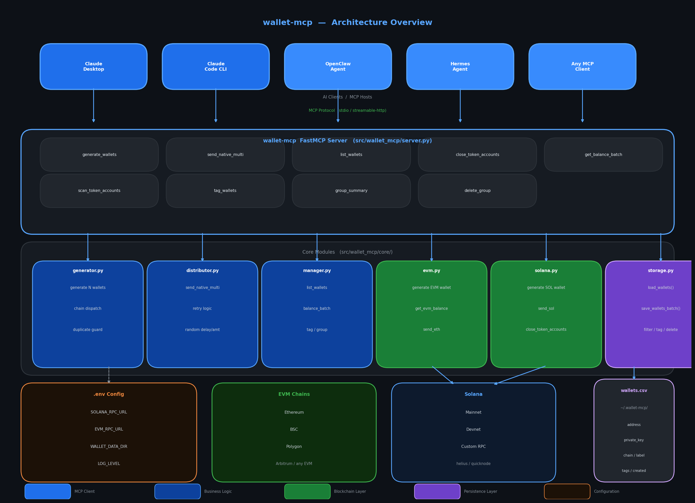

# Architecture Overview



---

## Layers

```
┌─────────────────────────────────────────────────────────────────────┐
│                        AI CLIENTS / MCP HOSTS                       │
│         Claude Desktop │ Claude Code │ OpenClaw │ Hermes │ Any MCP  │
└────────────────────────────────┬────────────────────────────────────┘
                                 │  MCP Protocol (stdio / streamable-http)
                                 ▼
┌─────────────────────────────────────────────────────────────────────┐
│               wallet-mcp  FastMCP Server  (server.py)               │
│                                                                     │
│  generate_wallets    send_native_multi   sweep_wallets               │
│  export_wallets      list_wallets        get_balance_batch          │
│  scan_token_balances close_token_accts   scan_token_accts           │
│  tag_wallets         group_summary       delete_group               │
└──────────┬────────────────┬────────────────┬───────────────┬────────┘
           │                │                │               │
           ▼                ▼                ▼               ▼
┌──────────────┐  ┌──────────────┐  ┌──────────────┐  ┌──────────────┐
│ generator.py │  │distributor.py│  │  manager.py  │  │  storage.py  │
│              │  │              │  │              │  │              │
│ generate N   │  │ send to group│  │ list_wallets │  │ wallets.csv  │
│ wallets      │  │ retry logic  │  │ balance_batch│  │ load / save  │
│ chain select │  │ random delay │  │ tag / group  │  │ filter / del │
└──────┬───────┘  └──────┬───────┘  └──────────────┘  └──────┬───────┘
       │                 │                                     │
       ▼                 ▼                                     ▼
┌──────────────┐  ┌──────────────┐                   ~/.wallet-mcp/
│   evm.py     │  │  solana.py   │                   wallets.csv
│              │  │              │
│ generate     │  │ generate     │
│ balance      │  │ balance      │
│ send_eth     │  │ send_sol     │
└──────┬───────┘  │ close_token  │
       │          │ accounts     │
       │          └──────┬───────┘
       ▼                 ▼
  EVM Chains        Solana Chain
  ETH / BSC         Mainnet
  Polygon           Devnet
  Arbitrum          Custom RPC
```

---

## Component Descriptions

### AI Clients / MCP Hosts

Any MCP-compatible client that communicates with the server over the MCP protocol.

| Client | Transport | Notes |
|---|---|---|
| Claude Desktop | stdio | Add to `claude_desktop_config.json` |
| Claude Code CLI | stdio | `claude mcp add wallet-mcp` |
| OpenClaw | stdio / HTTP | SKILL.md compatible |
| Hermes | stdio | Standard MCP |
| Custom | stdio or streamable-http | `wallet-mcp streamable-http` |

---

### FastMCP Server (`server.py`)

The MCP server layer. Exposes 13 tools via `@mcp.tool()` decorator. All tool inputs and outputs are typed dicts. Handles errors internally — always returns `{status: "success" | "error", ...}`.

**Entry point:** `wallet_mcp.server:main`  
**Transport:** stdio (default) or `streamable-http` (pass arg)  
**Startup:** loads `.env` via `python-dotenv` before anything else

#### Tools

| Tool | Core Module | Chain |
|---|---|---|
| `generate_wallets` | generator.py | EVM + Solana |
| `send_native_multi` | distributor.py | EVM + Solana |
| `sweep_wallets` | distributor.py | EVM + Solana |
| `export_wallets` | exporter.py | Both |
| `import_wallets` | importer.py | Both |
| `list_wallets` | manager.py | Both |
| `get_balance_batch` | manager.py | Both |
| `scan_token_balances` | manager.py | EVM + Solana |
| `close_token_accounts` | solana.py | Solana only |
| `scan_token_accounts` | solana.py | Solana only |
| `tag_wallets` | manager.py | Both |
| `group_summary` | manager.py | Both |
| `delete_group` | manager.py | Both |

---

### Core Modules (`core/`)

#### `generator.py`
- Accepts chain + count + label
- Dispatches to `evm.py` or `solana.py` via dynamic import
- Deduplicates before saving
- Calls `storage.save_wallets_batch()` in one write

#### `distributor.py`
- `send_native_multi` — iterates recipients, calls `send_eth`/`send_sol` per wallet, retry + random delay + random amount
- `sweep_native_multi` — reads balance per wallet, sends `balance - fee_reserve` to destination; skips wallets with insufficient balance

#### `manager.py`
- `list_wallets` — filter + mask private keys by default
- `get_balance_batch` — groups by chain, single RPC client per chain
- `scan_token_balances` — SPL all-tokens or filter-by-mint (Solana); ERC-20 contract required (EVM)
- `group_summary` — aggregates from CSV with `defaultdict`
- `tag_label`, `delete_group` — delegates to storage

#### `evm.py`
- Uses `eth_account` for keypair generation
- Uses `web3.py` for balance + transfer
- `get_erc20_balances_batch` — reads `balanceOf`/`decimals`/`symbol` via minimal ERC-20 ABI
- `sweep_eth_wallet` — sends `balance - 21000*gas_price` to destination
- RPC URL configurable per call or via `EVM_RPC_URL` env

#### `solana.py`
- Uses `solders.keypair.Keypair` for keypair generation
- Private key stored as base58-encoded 64-byte secret (Phantom-compatible)
- Uses `solana.rpc.api.Client` for RPC calls
- `get_spl_balances_batch` — calls `get_token_accounts` per wallet, optional mint filter
- `sweep_sol_wallet` — sends `balance - leave_lamports` to destination
- `close_token_accounts`: builds raw `CloseAccount` instruction (opcode 9) without SPL dependency
- Token account parsing handles both `dict` and object forms across solana-py versions

#### `exporter.py`
- `export_wallets(wallets, fmt, output_path, include_keys)` — writes JSON (pretty-printed) or CSV
- Strips private keys by default (`include_keys=False`)
- Auto-generates timestamped filename under `~/.wallet-mcp/exports/` when path omitted

#### `importer.py`
- `import_wallets(file_path, fmt, label, tags)` — reads JSON array or CSV, skips duplicates, saves new wallets
- Format auto-detected from `.json` / `.csv` extension when `fmt='auto'`
- Label and tags can be overridden at import time; falls back to file's own `label` field

#### `storage.py`
- Plain CSV, no ORM, no database
- All reads/writes go through `_ensure_file()` guard
- `_rewrite()` used for mutations (tag, delete) — reads all → modifies → rewrites
- Path resolves from `WALLET_DATA_DIR` env or `~/.wallet-mcp/`

#### `utils.py`
- `retry(fn, attempts, delay)` — generic retry wrapper, guards `attempts < 1`
- `random_delay(min, max)` — `time.sleep(random.uniform(...))`
- `random_amount(base, variance=0.10)` — `±10%` by default
- `setup_logging()` — file logger to `~/.wallet-mcp/wallet-mcp.log`

---

### Configuration (`.env`)

Loaded at server startup via `python-dotenv`. All values have safe defaults.

| Variable | Default | Description |
|---|---|---|
| `SOLANA_RPC_URL` | Solana mainnet public | Solana RPC endpoint |
| `EVM_RPC_URL` | Infura public | EVM RPC endpoint |
| `WALLET_DATA_DIR` | `~/.wallet-mcp` | Storage directory |
| `LOG_LEVEL` | `INFO` | Logging verbosity |

---

### Storage (`wallets.csv`)

```
address,private_key,chain,label,tags,created_at
So1anaXxx...,5Kd3N...,solana,airdrop1,funded|vip,2024-01-01T00:00:00Z
0xABCD...,0x1234...,evm,test,,2024-01-01T00:00:00Z
```

Location: `~/.wallet-mcp/wallets.csv`  
Override: `WALLET_DATA_DIR=/custom/path`

---

## Data Flow Example — `send_native_multi`

```
Agent: "Send 0.01 SOL to airdrop1 group with random delays"
  │
  ▼
server.py::send_native_multi(from_key, label="airdrop1", amount=0.01, chain="solana", randomize=True)
  │
  ├─► storage.filter_wallets(chain="solana", label="airdrop1")
  │       └─► returns list of 50 wallet dicts from wallets.csv
  │
  └─► distributor.send_native_multi(recipients=50 wallets, ...)
          │
          ├─► [wallet 1]  random_amount(0.01) → 0.0098
          │   retry(send_sol(from_key, addr1, 0.0098, rpc))
          │   random_delay(2, 15) → sleep 7.3s
          │
          ├─► [wallet 2]  random_amount(0.01) → 0.0103
          │   retry(send_sol(from_key, addr2, 0.0103, rpc))
          │   random_delay(2, 15) → sleep 11.1s
          │
          └─► ... repeat for all 50 wallets
                  │
                  └─► return {status, total:50, sent:50, failed:0, results:[...]}
```

---

## Dependency Graph

```
server.py
  ├── mcp (FastMCP)
  ├── python-dotenv
  └── core/
        ├── generator.py
        │     ├── utils.py
        │     ├── storage.py
        │     └── [evm.py | solana.py]  (dynamic import)
        │
        ├── distributor.py
        │     ├── utils.py
        │     ├── evm.py  ──► web3, eth-account
        │     └── solana.py ► solana, solders, base58
        │
        ├── manager.py
        │     ├── storage.py
        │     ├── evm.py
        │     └── solana.py
        │
        └── storage.py
              └── utils.py
```
